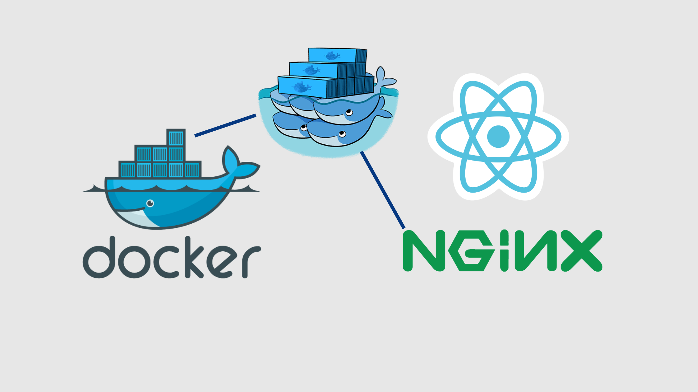
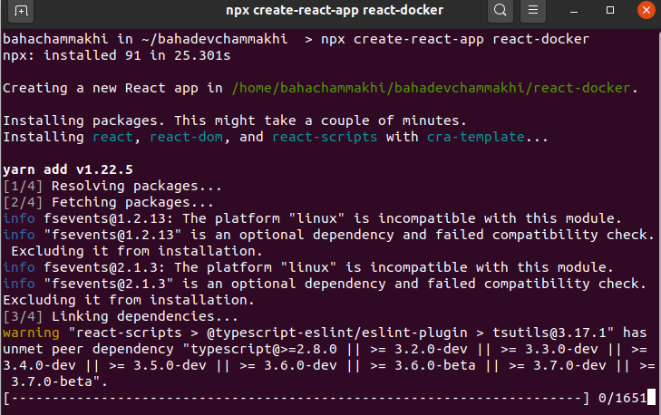
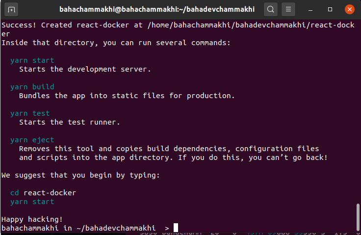
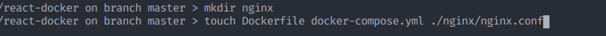
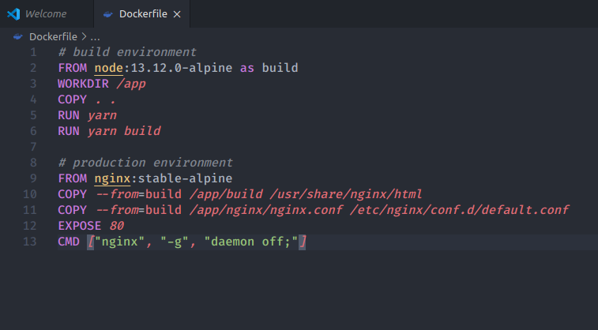
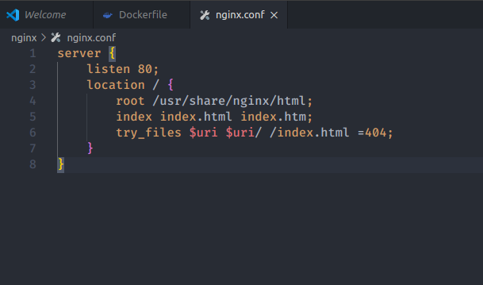
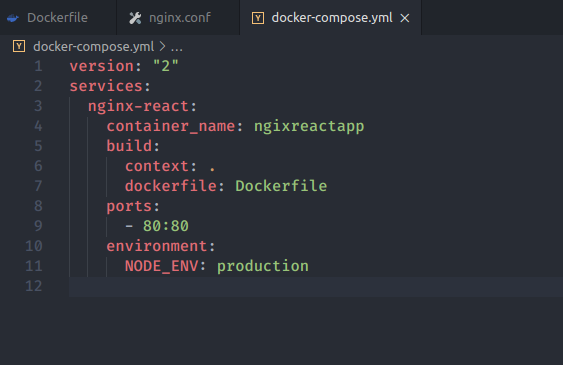
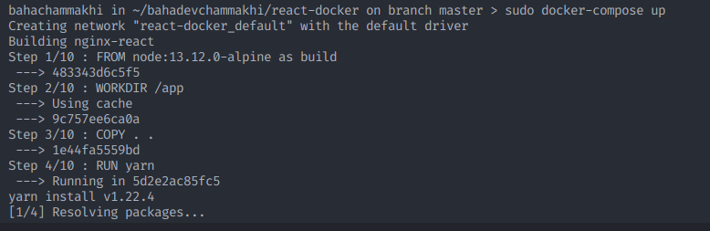

# Dockerizing a React App with Nginx, using multi-stage builds.



[Docker](https://www.docker.com/) is a containerization tool used to speed up the development and deployment processes, It's the most popular solution for containerization.

Containers allow us to run and develop an application in the same environment, regardless of what machine you’re on.

---

Docker-compose is a tool for defining and running multi-container Docker applications.

---

[Nginx](https://www.nginx.com/) is a web server we gonna uses it to serve static content, it can be used as a reverse proxy, load balancer.

---

[React](https://reactjs.org/) is an open-source, front end, JavaScript library for building user interfaces or user interface components.

---

This tutorial demonstrates how to Dockerize a React app with Nginx using multi-stage builds. We’ll specifically focus on configuring a production-ready image using multistage builds.

## Creating A React Project:

We will use [Create react app](https://reactjs.org/docs/create-a-new-react-app.html) to generate our react project.

- Open your terminal in a specific location and run this command.

```bash
npx create-react-app react-docker
```



- Enter into your project directory:

```bash
cd react-docker
```



---

## Docker files:

### Create Dockerfile and docker-compose.yml

```bash
mkdir nginx
touch Dockerfile docker-compose.yml nginx/nginx.conf
```



### **Open Dockerfile**

```yaml
# build environment
FROM node:13.12.0-alpine as build
WORKDIR /app
COPY . .
RUN yarn
RUN yarn build

# production environment
FROM nginx:stable-alpine
COPY --from=build /app/build /usr/share/nginx/html
COPY --from=build /app/nginx/nginx.conf /etc/nginx/conf.d/default.conf
EXPOSE 80
CMD ["nginx", "-g", "daemon off;"]
```



### Whats happening here ?

1. We’re telling Docker to grab a copy of Node, specify its Linux distribution as Alpine and name it to build. Why Alpine? Alpine Linux is much smaller than most distribution base images (~5MB), and thus leads to much slimmer images in general.
2. Setting our working directory to app
3. Copying project to our directory
4. Running yarn to install packages
5. Running build script to generate build files
6. Telling docker to grap nginx-alpine image
7. Copying build files
8. Copying nginx configuration files to replace the default configuration
9. This line is just for documentation that our application will work on port 80
10. Running nginx

---

### **Open nginx.conf**

```wasm
server {
  listen       80;
  location / {
    root   /usr/share/nginx/html;
    index  index.html index.htm;
    try_files $uri $uri/ /index.html =404;
  }
}
```

We are just mentioning the position of our application static files to let Nginx consume them whenever someone sends a request to port 80.



### Open docker-compose.yml

```yaml
version: "2"
services:
  nginx-react:
    container_name: ngixreactapp
    build:
      context: .
      dockerfile: Dockerfile
    ports:
      - 80:80
    environment:
      NODE_ENV: production
```

We are giving our app a name, mentioning the dockerfile to use, mapping port 80 to the application port 80, adding some environment variables.



### Run our container

```bash
docker-compose up
```

### Run container in detached mode

```bash
docker-compose -d up
```



If you are using linux you need to use sudo on every docker command you use !

---
